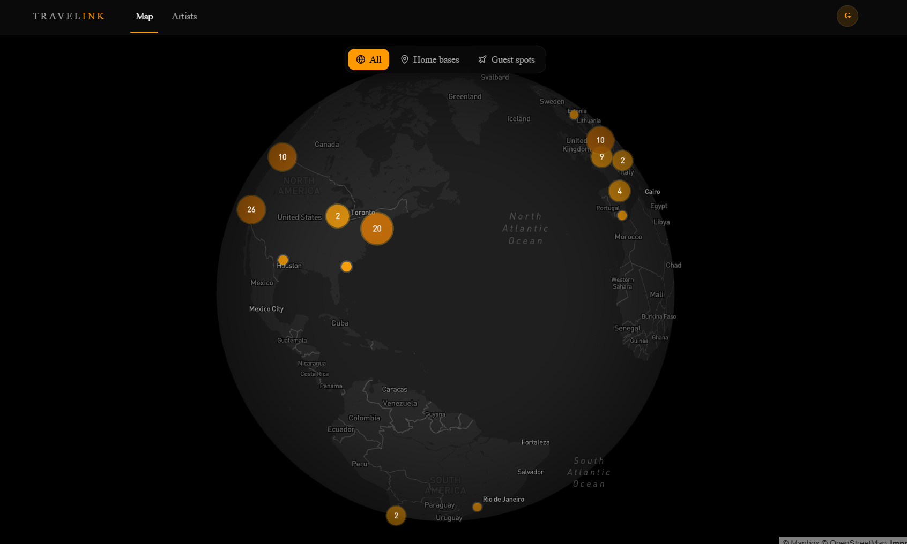
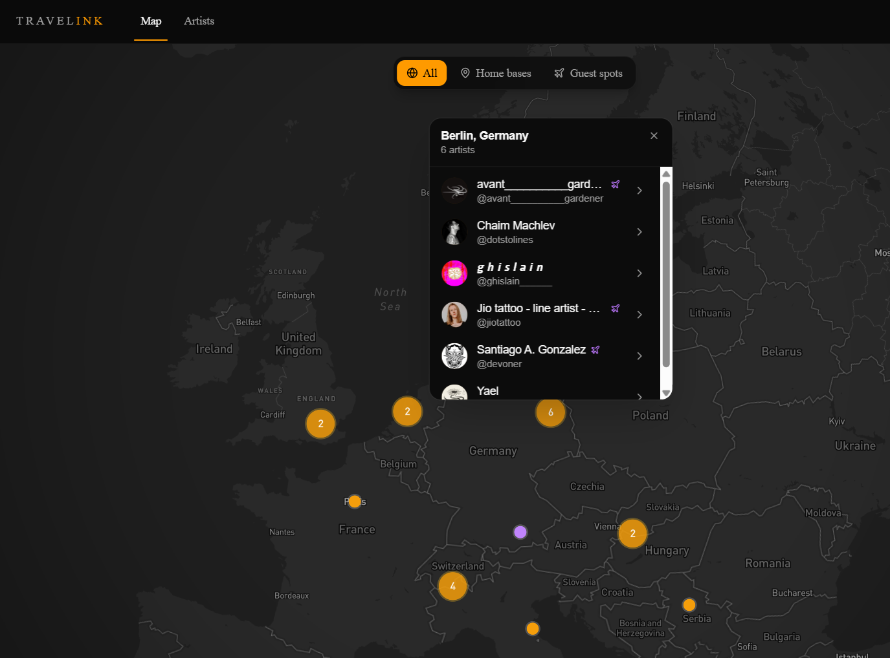
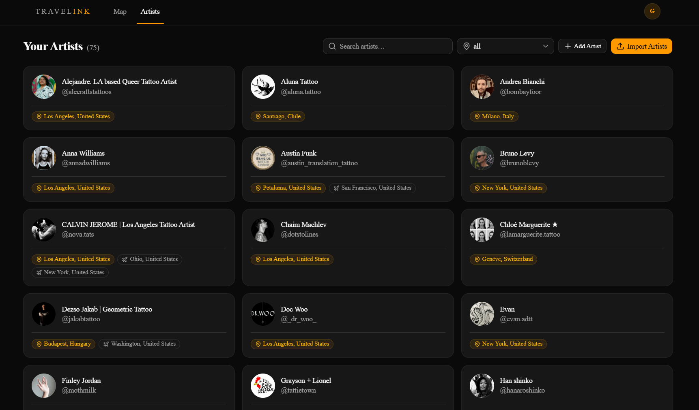

# Travelink

**Your tattoo artists, on one map.**

Tattoo artists move between studios, guest spots and conventions, and they often post where they'll be in their
Instagram bio. Travelink reads the bios of the artists you follow and puts them all on one map, so you can see where
each one is based and where they're guesting next.



## How it works

1. **Add your artists.** Import the accounts you follow on Instagram, or add artists one at a time.
2. **Travelink reads their bios.** In the background, it fetches each bio and uses Claude to pick out the artist's
   home base, guest spots and guest spot dates.
3. **Find them on the map.** Every location gets a pin, so you can see who works in a city, or where an artist is
   headed next.

## The map

- A dark globe you can spin and zoom. Nearby artists merge into numbered clusters that split apart as you zoom in
- Home bases are purple and guest spots are amber. Show **All**, only **Home bases**, or only **Guest spots**
- Click a pin or a city's cluster to see who's there, with a plane next to guest spots. Each artist links to their
  page and their Instagram
- A side panel lists the artists in view. Click one to fly to them



## Your artists

- Every artist you've added, in one grid, with their home base and guest spots (and dates, when the bio has them)
- Search by name, handle or city, or filter by location
- Each artist has a page with their bio and locations. You can add or fix locations by hand, for example when the
  bio isn't public or a guest spot was only announced in a post
- Bios are read once, when an artist is added. When an artist moves or announces new guest spots, **Refresh bio** on
  their page reads it again. Hand-added locations are kept. If the bio was checked in the last 72 hours, Travelink
  asks you to confirm first, since each refresh uses one of the day's bio lookups
- **Refresh bios** on the Artists page reads every artist's bio again, in the background. It skips bios checked in
  the last 72 hours unless you include them. Newly added artists still go first, and if the day's lookups run out,
  the rest continue the next day
- Removing an artist only takes them off your list. Anyone else who added them keeps them



## Adding artists

- **Import who you follow.** Paste your Instagram session cookie to load your following list directly, or upload
  `following.json` from an Instagram data export. The import page explains how to get either one. Tick the artists
  you want and they're saved right away. The list and your ticks stay in this browser, so you can come back and add
  more in batches
- **Add one artist.** Enter their Instagram handle, or connect your session cookie to search as you type

Bios load in the background while any Travelink page is open, so you can keep browsing. The Artists page shows how
many are left. If Instagram limits requests, the queue pauses and picks up again by itself. Nothing is lost.

Bios come from Instagram Business Discovery, Instagram's official API. It only sees public Business and Creator
accounts, so personal accounts show **No public bio**, and you can add their location by hand.

That's why **Hide personal** is on by default when you import. It hides private accounts (Business and Creator
accounts can't be private) and accounts an earlier lookup found to be personal. Instagram's list doesn't say which
accounts are business, so some personal accounts still show. Data exports don't say which accounts are private
either, so loading the list with your session cookie hides more.

Accounts with a tattoo word in their handle or name (tattoo, tats, ink, tatuaje and a few other languages) are
listed first, under **Likely tattoo artists**, with a button to select them all.

## Privacy

Your Instagram session cookie stays in the open tab's memory. It's dropped when you reload or close the tab or sign
out, and it's never stored on the server. The server only accepts it from the Travelink account that connected it.
It's used only to read your following list and to search Instagram when you add an artist. Importing a data export
doesn't need the cookie at all.

## Invites and limits

Travelink is invite-only. An admin creates a single-use invite link on the **Admin** page (avatar menu → Admin) and
sends it. The link opens a short intro page, and **Get started** goes to sign-up (email and password) with the
invite already filled in.

To cap costs, bio lookups have daily limits, overall and per user, that reset at midnight UTC. When a limit is hit,
the queue waits for the reset. Admins can see today's usage, manage invites and disable users on the Admin page.

## Built with

Next.js 15 · TypeScript · PostgreSQL + Prisma · NextAuth · Claude API · Mapbox GL · Tailwind CSS + shadcn/ui ·
Vercel + Neon

## Running it yourself

```sh
npm install
docker compose up -d     # PostgreSQL
cp .env.example .env     # then fill in your keys
npx prisma migrate dev
npm run dev              # http://localhost:3000
```

[docs/development.md](docs/development.md) covers the API keys, setting up Instagram Business Discovery and
deploying to Vercel.
